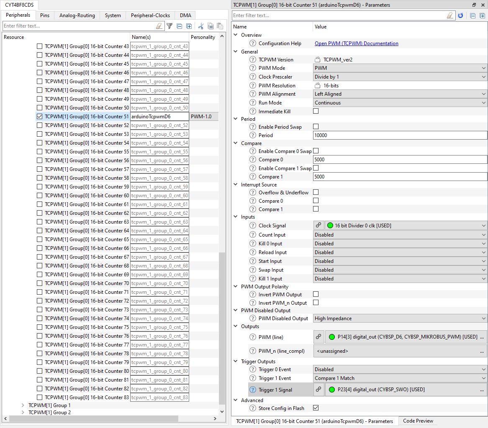

# Trigger Multiplexer TRIG_DBG signal
**This code example demonstrates the usage of the TRIG_DBG signal at a port pin as a means for debugging on-chip trigger activity.**  

## Device
The device used in this code example (CE) is:
- [TRAVEO™ T2G CYT4BF Series](https://www.infineon.com/cms/en/product/microcontroller/32-bit-traveo-t2g-arm-cortex-microcontroller/32-bit-traveo-t2g-arm-cortex-for-body/traveo-t2g-cyt4bf-series/)

## Board
The board used for testing is:
- TRAVEO™ T2G evaluation kit ([KIT_T2G-B-H_LITE](https://www.infineon.com/cms/en/product/evaluation-boards/kit_t2g-b-h_lite/))

## Scope of work
In this example, one of the trigger outputs of a Timer Counter Pulse Width Modulation (TCPWM) HW module is observable at a port pin using the Trigger Multiplexer HSIOM_IO_OUTPUT trigger output and TRIG_DBG port function. In a real application this could be used for debugging purposes to check the occurrence of trigger events or their temporal relationship to other signals.

## Introduction  

**Trigger Multiplexer**  
TRAVEO™ T2G platform supports the following Trigger Multiplexer features:
- Ability to connect any trigger signal from one peripheral to another
- Provides up to 16 multiplexer-based trigger groups and up to 16 one-to-one trigger groups
- Supports a software trigger, which can trigger any signal in the block
- Ability to configure a trigger multiplexer with trigger manipulation features in hardware such as inversion and edge/level detection

More details can be found in [Technical Reference Manual (TRM)](https://www.infineon.com/dgdl/?fileId=5546d4627600a6bc017600bfae720007), [Registers TRM](https://www.infineon.com/dgdl/?fileId=5546d4627600a6bc017600be2aef0004) and [Data Sheet](https://www.infineon.com/dgdl/?fileId=5546d46275b79adb0175dc8387f93228).

## Hardware setup
This CE has been developed for:
- TRAVEO™ T2G evaluation kit lite ([KIT_T2G-B-H_LITE](https://www.infineon.com/cms/en/product/evaluation-boards/kit_t2g-b-h_lite/)) 
   
No changes are required from the board's default settings.

Two oscilloscope or logic analyzer probes should be connected to
- *CYBSP_D6* port pin outputs a PWM signal. This signal is available at the digital I/O #6 of the Arduino connector (no Arduino extension board required).
- *P23.4* which will output TRIG_DBG[0] signal, the trigger output signal. This signal is available at the additional debugger connector on the board.  

Please refer to the board schematic for more information about the pinout of the Arduino connector and additional debug connector.

## Implementation
This design consists of one TCPWM that will be configured to output a PWM signal with 50% duty at the pin *CYBSP_D6* (Digital I/O #6 of the Arduino connector). After startup the TCPWM Trigger Out #1 signal is configured to occur at 50% of the PWM period (this can later be changed during runtime via the UART terminal). TCPWM Trigger Out #1 is a trigger input signal of the Trigger Multiplexer HW module where it will be connected to the HSIOM_IO_OUTPUT[0] trigger output signal. This signal can then be made observable at every port pin that has the TRIG_DBG[0] alternate port function. In this code example P23.4 has been chosen. 
The user will able to change the trigger point in time between 0% and 100% of the PWM period, by using a terminal program and entering the '+' or '-' keys. The current value is always shown in the terminal.

Note: In a real application the TCPWM trigger output would for example trigger an ADC conversion, and in parallel it could be output on a port pin for debugging purposes.

**STDOUT/STDIN setting**

Initialization of the GPIO for UART is done in the <a href="https://infineon.github.io/retarget-io/html/group__group__board__libs.html#gaddff65f18135a8491811ee3886e69707"><i>cy_retarget_io_init()</i></a> function.
- Initializes the pin specified by *CYBSP_DEBUG_UART_TX* as UART TX and the pin specified by *CYBSP_DEBUG_UART_RX* as UART RX (these pins are connected to KitProg3 COM port)
- The serial port parameters are 8N1 and 115200 baud

**TCPWM initialization**

API calls for the TCPWM initialization are done in *InitArduinoTcpwmD6()* function.
- For initialization of the TCPWM, <a href="https://infineon.github.io/mtb-pdl-cat1/pdl_api_reference_manual/html/group__group__tcpwm__functions__pwm.html#ga6440d2a9dc8d85056abd62556bee7f82"><i>Cy_TCPWM_PWM_Init()</i></a> is called with appropriate arguments by using macros and configuration structure <a href="https://infineon.github.io/mtb-pdl-cat1/pdl_api_reference_manual/html/structcy__stc__tcpwm__pwm__config__t.html"><i>cy_stc_tcpwm_pwm_config_t</i></a> which are auto-generated by the Device Configurator

  *Figure 1. TCPWM configuration* 

- Then the TCPWM is enabled by <a href="https://infineon.github.io/mtb-pdl-cat1/pdl_api_reference_manual/html/group__group__tcpwm__functions__pwm.html#ga802ebf3a49b1056e4bc5b057deb26e49"><i>Cy_TCPWM_Counter_Enable()</i></a>
- Last step is to trigger the TCPWM via <a href="https://infineon.github.io/mtb-pdl-cat1/pdl_api_reference_manual/html/group__group__tcpwm__functions__common.html#gaafe86ec440bec9a2c23392f289cc3a8b"><i>Cy_TCPWM_TriggerStart_Single()</i></a>

**Trigger configuration**

The Device Configurator allows the direct selection of any internal trigger signal as Digital Output function, if the respective port pin has the TRIG_DBG functionality. In addition to the port pin configuration the tool will also automatically generate the required Trigger Multiplexer PDL driver API calls in function *init_cycfg_routing()* which will be called from *cybsp_init()*. 

*Figure 2. Port pin configuration for TRIG_DBG functionality* 

**Code Example main loop**

The endless loop of the Code Example in *main()* always checks whether a character has been received from the user via UART (terminal) using <a href="https://infineon.github.io/mtb-hal-cat1/html/group__group__hal__uart.html#ga89108b2d339dc9863ec660588e3a4a12"><i>cyhal_uart_getc()</i></a>. The user interface supports two characters:
- *-* decreases the trigger point position by 1% (until 0% is reached)
- *+* increases the trigger point position by 1% (until 100% is reached)

The new trigger position will be reflected to TCPWM by <a href="https://infineon.github.io/mtb-pdl-cat1/pdl_api_reference_manual/html/group__group__tcpwm__functions__pwm.html#gae9dfa26ff90263db912df5c8bc609460"><i>Cy_TCPWM_PWM_SetCompare1Val()</i></a> then will be updated in the terminal.

## Run and Test
For this example, a terminal emulator is required for displaying outputs and to change settings during runtime. Install a terminal emulator if you do not have one. Instructions in this document use [Tera Term](https://ttssh2.osdn.jp/index.html.en).

After code compilation, perform the following steps for flashing the device:
1. Connect the board to your PC using the provided USB cable through the KitProg3 USB connector.
2. Open a terminal program and select the KitProg3 COM port. Set the serial port parameters to 8N1 and 115200 baud.
3. Program the board using one of the following:
    - Select the code example project in the Project Explorer.
    - In the **Quick Panel**, scroll down, and click **[Project Name] Program (KitProg3_MiniProg4)**.
4. After programming, the code example starts automatically. Confirm that the messages are displayed on the UART terminal:

   *Figure 3. Terminal output on program startup* 

5. You can debug the example to step through the code. In the IDE, use the **[Project Name] Debug (KitProg3_MiniProg4)** configuration in the **Quick Panel**. For details, see the "Program and debug" section in the [Eclipse IDE for ModusToolbox™ software user guide](https://www.cypress.com/MTBEclipseIDEUserGuide).

**Note:** **(Only while debugging)** On the CM7 CPU, some code in *main()* may execute before the debugger halts at the beginning of *main()*. This means that some code executes twice: once before the debugger stops execution, and again after the debugger resets the program counter to the beginning of *main()*. See [KBA231071](https://community.cypress.com/docs/DOC-21143) to learn about this and for the workaround.

### Expected behavior

Below you can find logic analyzer screenshots of the expected behavior for 3 different cases of the trigger position: 50% (default), 25% and 75%.
- Channel D0: PWM output
- Channel D1: Trigger output (TRIG_DBG)

*Figure 4. Logic Analyzer screenshot for 50% trigger position (default)*   

*Figure 5. Logic Analyzer screenshot for 25% trigger position*   

*Figure 6. Logic Analyzer screenshot for 75% trigger position*   

## References  

Relevant Application notes are:
- AN235305 - GETTING STARTED WITH TRAVEO™ T2G FAMILY MCUS IN MODUSTOOLBOX™
- [AN228104](https://www.infineon.com/dgdl/?fileId=8ac78c8c7cdc391c017d0d3e7ff367de) - How to Use Trigger Multiplexer in TRAVEO™ T2G Family
- [AN220224](https://www.infineon.com/dgdl/?fileId=8ac78c8c7cdc391c017d0d3a800a6752) - How to Use Timer, Counter, and PWM (TCPWM) in TRAVEO™ T2G Family

ModusToolbox™ is available online:
- <https://www.infineon.com/modustoolbox>

Associated TRAVEO™ T2G MCUs can be found on:
- <https://www.infineon.com/cms/en/product/microcontroller/32-bit-traveo-t2g-arm-cortex-microcontroller/>

More code examples can be found on the GIT repository:
- [TRAVEO™ T2G Code examples](https://github.com/orgs/Infineon/repositories?q=mtb-t2g-&type=all&language=&sort=)

For additional trainings, visit our webpage:  
- [TRAVEO™ T2G trainings](https://www.infineon.com/cms/en/product/microcontroller/32-bit-traveo-t2g-arm-cortex-microcontroller/32-bit-traveo-t2g-arm-cortex-for-body/traveo-t2g-cyt4bf-series/#!trainings)

For questions and support, use the TRAVEO™ T2G Forum:  
- <https://community.infineon.com/t5/TRAVEO-T2G/bd-p/TraveoII>  
